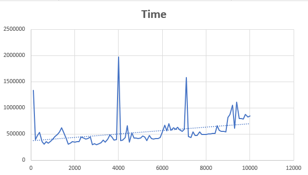
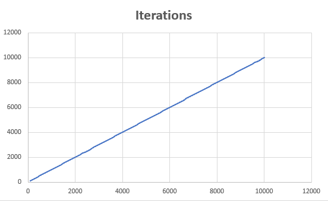

<h1>Bucket Sort/Блочная сортировка</h1>
<h2>Идея</h2>
Блочная сортировка (Карманная сортировка, корзинная сортировка, англ. Bucket sort) — алгоритм сортировки, 
в котором сортируемые элементы распределяются между конечным числом отдельных блоков (карманов, корзин) так, 
чтобы все элементы в каждом следующем по порядку блоке были всегда больше (или меньше), чем в предыдущем. 
Каждый блок затем сортируется отдельно, либо рекурсивно тем же методом, либо другим. Затем элементы помещаются 
обратно в массив. Этот тип сортировки может обладать линейным временем исполнения.

Данный алгоритм требует знаний о природе сортируемых данных, выходящих за рамки функций "сравнить" и "поменять 
местами".

<h2>Временная сложность</h2>

Оценим сложность алгоритма блочной сортировки для случая, при котором в качестве алгоритма сортировки блоков 
используется быстрая сортировка.

Пусть на входе имеется массив размера n. Количество блоков равно k. Числом ni определим количество
элементовв одной корзине. В каждой корзине примерно будет содержаться ni = n / k элементов. 
Для сортировок самих корзинок я буду использовать быструю сортировку. Тогда сортировка одной корзины займет 
порядка  O(ni * log(ni)) итераций. То есть, для k корзин это займет порядка 
O(k * ni * log(ni)) итераций.

Пусть k → n. Тогда ni → 1. Отсюда: O(k * ni * log(ni)) ~ O(n * 1 * log(1)) ~ O(n).

Однако если элементы входного массива будут малоразличимы, то функция распределения элементов
по корзинам может отработать неудачно. В худшем случае у нас будет k - 1 пустых
блоков и 1 блок, содержащий все элементы входного массива. В таком случае, весь массив
будет отсортирован быстрой сортировкой, который в худшем случае отработает за
O(n2) операций.

Получаем, что алгоритм в среднем работает за O(n), а в худшем случае за O(n2) операций.

<h2>Пространственная сложность</h2>

Поскольку элементы массива будут распределяться по блокам, то алгоритм будет хранить все n элементов 
входного массива. Следовательно, пространственная сложность алгоритма будет порядка O(n).

<h2>Графики зависимости итераций и времени работы от размера и характера данных</h2>

<h2>Преимущества и недостатки алгоритма</h2>
<h3>Преимущества:</h3>

При удачных входных данных может иметь линейную сложность;

Поскольку каждая корзина сортируется отдельно, приходится сортировать гораздо меньшие массивы, 
что дает большой выигрыш по времени.

<h3>Недостатки:</h3>

Сильно деградирует при большом количестве мало отличных элементов, или же на неудачной функции 
получения номера корзины по содержимому элемента;

Количество корзин нужно знать заранее;

Нельзя применить ко всем видам данных, поскольку потребуется подходящий способ группирования.

